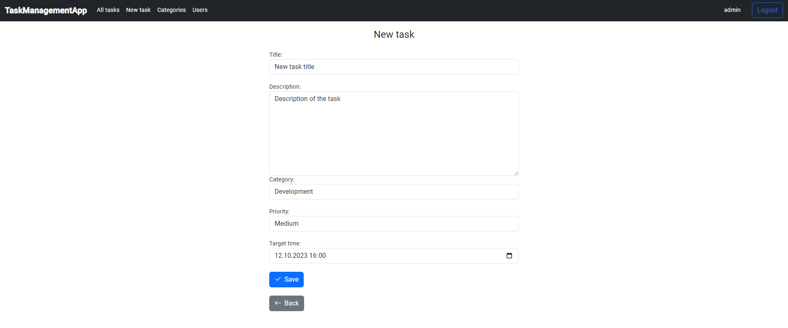
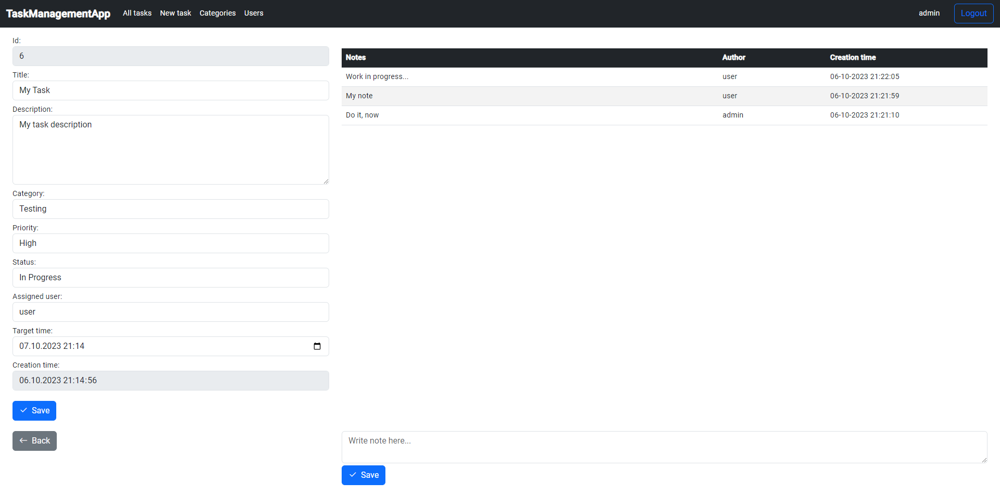
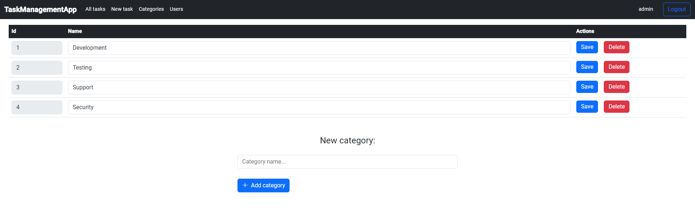

# Task Management App

- [Features and usage](#features-and-usage)
- [Technologies](#technologies)
- [Getting Started](#getting-started)
- [Screenshots](#screenshots)

## Features and usage

- **Task Management:** Create and manage tasks with detailed information and preferences. Tasks can be assigned specific categories, due dates, status, and priority, allowing users to prioritize their workload effectively. Each task is equipped with a notes section, where users can add relevant details, updates, or additional information. Notes can be edited or deleted as the task progresses. If a task has been completed, users have the option to mark it with an appropriate status, which will remove the task from the main list while still being accessible through filtering and searching options.

- **Category Customization:** Users have the ability to create new categories, edit existing ones and delete categories that are no longer needed. This flexibility ensures that tasks are organized in a manner that suits individual preferences.

- **Sorting and Filtering:** The task list is equipped with sorting and filtering options, allowing users to arrange tasks based on criteria such as id, task title, due date, status, or category. This ensures that users can focus on tasks that require immediate attention.

## Technologies

- **Java 17**
- **Spring Boot 3**
- **PostgreSQL 15**
- **Angular 12**
- **Bootstrap 5**

## Getting Started

To set up and run the project on your local machine:

1. **Prerequisites:** Ensure you have Java, PostgreSQL, Node.js, and Angular CLI installed.

2. **Clone the repository:** Use the command below to clone the repository.
   
    `git clone https://github.com/kamhol1/task-management-app.git`

3. **Database Setup:** Create a PostgreSQL database and update the database configuration in
   
    `application.properties`.

4. **Backend Setup:** Navigate to the backend directory and start the Spring Boot server.
   
    `./mvnw spring-boot:run`

5. **Frontend Setup:** Navigate to the frontend directory (located in main project directory) and install dependencies, then start the Angular app.

    `npm install`

    `ng serve`

6. **Access the App:** Open your browser and navigate to `http://localhost:4200`

## Screenshots

> Task list page

> Task creation form

> Task details with notes

> Category list
